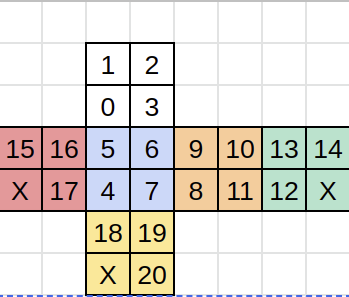

# Cubo Mágico o Cubo Rubik

## Problema:
El cubo Rubik o cubo mágico es un rompecabezas mecánico tridimensional creado por Ernő Rubik en 1974.
El cubo mágico de 2x2x2 también llamado mini cubo o mini rubik tiene 3.674.160 combinaciones.
El camino más largo a la
solución es de 14
movimientos.

Este programa permite resolver este cubo mediante estos metodos de busqueda no informados:
- BPA
- BPP 
- BPPV

También lo puede resolver mediante estos metodos de busqueda informados:

- Heurística Local
- Heurística Global
- A*

También se implementaron heuristicas para resolver el problema

## Instalación y Ejecución
Instalación de todos los requerimientos previos: ./init.sh

Ejecución: python3 main.py *(archivo.json)
el parametro del archivo.json es opcional, si no se coloca nada se utiliza el config.json por default

## Guia de uso
En el config.json se pueden observar todos los parametros que pueden ser cambiados por el usuario

```
{
    "algorithm":"GH",
    "heuristic":"dist3D",
    "initial_state":"oowybbbgwrrowbygwyorg",
    "step": 2,
    "limit": 5,
    "max_depth": 10,
    "graphics": true
}
```

"algorithm" define que metodo de busqueda se va a usar:
- "BFS": Breadth-first search 
- "DFS": Depth-first search
- "DFSVL": Depth-first search variable limit
- "LH":Local Heuristic 
- "GH":Global Heuristic
- "A": A* 

"heuristics" define que heuristica se va a usar:
- "manhattan": Nos fijamos a que tan pocos movimientos está cada cubito de su lugar adecuado y orientación adecuada. Luego sumamos el resultado de cada cubito y lo dividimos por 4.
La división por 4 es porque con un movimiento de cubo, se pueden mover 4 cubitos a la vez
- "dist3D": Contamos cuántos de los 7 cubos están en el lugar y con la orientación adecuada,
La división por 4 es porque con un movimiento de cubo, se pueden mover 4 cubitos a la vez
(7 - #cubitosAdecuados)/4
- "rookie" : Algoritmo de los novatos.
La función cuenta cuantos colores correctos tiene cada cara, por ejemplo la cara superior es blanca así que cuenta cuántos blancos hay en esa cara y así con todas, se suman los valores de cada cara, luego se hace la resta de 21 -  ese número para que la heurística de un menor número si el estado se acerca a resolver el objetivo.

- "cubes":Contamos cuántos de los 7 cubos están en el lugar y con la orientación adecuada,
La división por 4 es porque con un movimiento de cubo, se pueden mover 4 cubitos a la vez
(7 - #cubitosAdecuados)/4


"initial_state":  Se coloca el estado inicial del cubo con comillas dobles:

<p align="center">
  
</p>
Los numeros de cada cuadrado muestra que numero de caracter es en la cadena.
Asi es como los primeros 4 caracteres representan la cara superior

"step": Este parametro solo aplica para el algoritmo "DFSVL" y significa cuanto varia el limite despues de haber llegado al limite maximo y no haber resolvido el cubo

"limit": Este parametro solo aplica para el algoritmo "DFSVL" y es el limite

"max_depth": Profundidad maxima para un cubo aleatorio (sin inicial_state) 

"graphics": se coloca true cuando se quiere tener los graficos y false cuando no.

Todos los items son opcionales ya que poseen valores por default

## Ejemplo de configuración
En este ejemplo se puede ver que el algoritmo elegido es Global Heuristic, la heuristica elegida es dist3D, el step y el limit los va a ignoran porque solo aplican para "DFSVL", tiene una profundidad maxima de 10 y adquiere los graficos 

```
{
    "algorithm":"GH",
    "heuristic":"dist3D",
    "initial_state":"oowybbbgwrrowbygwyorg",
    "step": 2,
    "limit": 5,
    "max_depth": 10,
    "graphics": true
}
```
